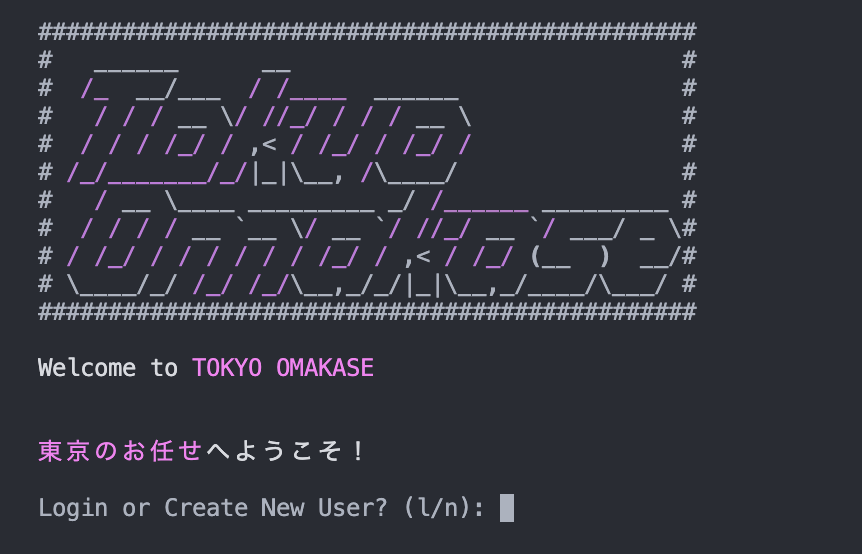

# Tokyo Omakase 東京のお任せ

Tokyo Omakase is your guide to Tokyo's best restaurants. You can do the following 

## Install and Run


This creates an environment to control dependencies

```
python lib/cli_main.py
```
Run Tokyo Omakase


## Welcome Page

After logging in, you will be prompted to either login or create a new account. 

### Login
To login to an existing account, enter 'l' and press enter. It will then prompt you to 'Enter User Name', enter in your username (including capitalization) and hit enter. If your account does not exist you will be prompted to choose between login and creating a user.

### Create a New User
To create anew user, enter 'n' and press enter. It will then prompt you to 'Enter New User Name', enter in your username an hit enter. 



## Home Page

The home page has 3 options available for you to choose...

1. Restaurants
2. Visits
3. Users

In this application, you can navigate to different menus by entering the corresponding menu number and hitting enter. You can go back in the directory by entering 'x' and hitting enter. By entering 'q' and hitting enter you can exit the entire program. At some points the application will prompt you with different commands, those will be available on the command line.

## Restaurants
Tokyo Omakase comes preloaded with 200+ Michellin rated restaurants that you can browse. There are 3 different ways to browse the restaurants...

1. View All Restaurants
2. Filter By Cuisine
3. Filter By Location

All of these options have the ability to view restaurant details, view its visits, and add your own visit.

### View All
View all allows a user to see all of the restaurants in one place. To navigate through pages enter 'n' for next OR 'p' for previous. Once you found a restaurant you would like to view, enter in the corresponding number and hit enter. This will display the restaurant details and options to...

1. View Visits
2. Add Visit

#### View Visits
View visits will display all of the stored visits about the restaurant. Details include...

1. User name
2. Description
3. Rating
4. Date

These visits allow users to express their sentiment towards their visit and leave any comments about dishes etc.

#### Add Visit

Add Visit allows a user to share their own experience with other users. You will be prompted with a series of questions about rating, description, and the date you went. 

After submitting you can view the same restaurant and check your own visit along with the others.


### Filter By Cuisine

Just like view all, filter by cuisine has the same restaurant viewer and visit functionality EXCEPT before viewing the restaurants you can choose to filter the restaurant list by a certain cuisine type...

1. Chinese
2. French
3. Hispanic
4. Italian
5. Japanese
6. Sushi
7. Tempura


### Filter By Location

Same as filter by cuisine, but you can filter the restaurants by location. In Tokyo, the city is split up into districts that they call wards. There are many wards but some have more restaurants than others. We created the following categories to encapsulate the best locations for dining in tokyo and represent relative geographic area...

1. Shibuya
2. Shinjuku
3. Bunkyo/Sumida/Taito
4. Chiyoda
5. Chuo
6. Meguro
7. Minato
8. Setagaya/Shinagawa


## Visits

## Users

